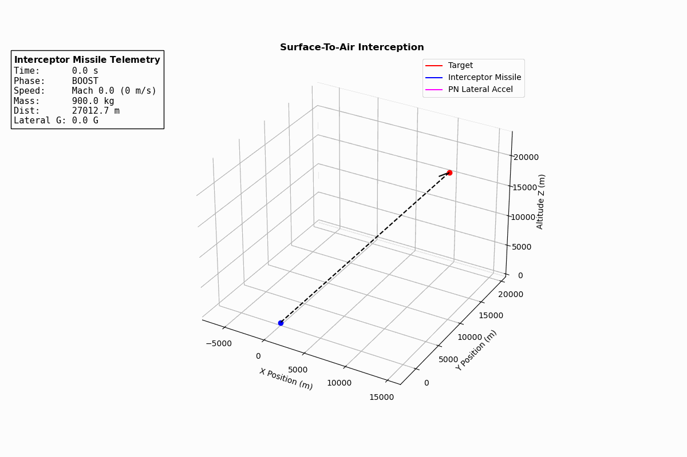
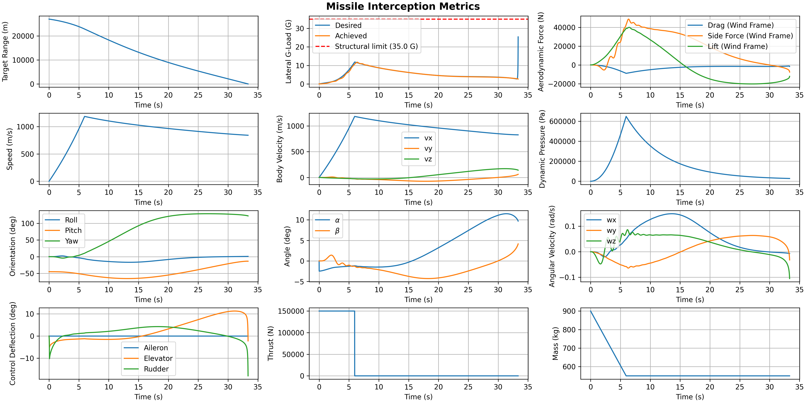

# Missile Guidance and Control
Implements and simulates 6-DoF Newton-Euler equations of motion for a missile running a proportional navigation (PN) guidance law and a flight controller, for surface-to-air interception scenarios.

## TODO
1) Add cross-coupling between forces and moments along multiple axes
2) Add variable inertia rate due to mass flow in dwbdt equations
3) Add changing moment arm to pitch due to changing CG from mass flow
4) Make force and moment coefficients functions of Mach instead of constants
5) Perform more rigorous controller design
6) Re-order functions in code to make logic flow easier to understand
7) Make data logging neater in simulation loop
8) Refactor code into appropriate files and classes